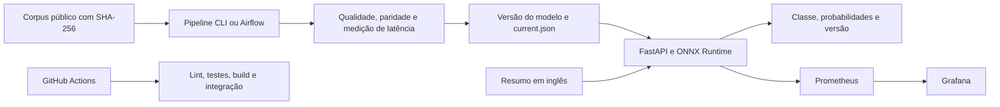

# Classificação de condições médicas — Tech Challenge Fase 3

API de classificação de resumos médicos em inglês usando **TF-IDF + regressão logística**, com inferência **ONNX Runtime**, retreino no **Airflow**, integração contínua no **GitHub Actions** e monitoramento com **Prometheus + Grafana**.

O projeto usa o **Medical Abstracts TC Corpus** e classifica cinco condições médicas. Essa adaptação do enunciado foi autorizada: o objetivo é classificar o assunto do resumo, sem estimar urgência. O uso é educacional; as probabilidades do modelo não são estimativas calibradas de risco clínico. Consulte a [documentação do modelo](docs/model_card.md).

## Arquitetura e decisão de nuvem

A inferência é síncrona: a API recebe um resumo, usa o modelo já carregado e devolve classe, probabilidades e versão. O treinamento roda separadamente, gera uma versão validada e publica um ponteiro atômico para os artefatos.



A proposta de produção usa **AWS ECS Fargate + Application Load Balancer** para inferência em tempo real. O ALB encaminha HTTP/HTTPS para as tarefas da API e verifica `/ready`; o Fargate evita administrar servidores para esse serviço leve. O processamento batch fica no retreino Airflow, que não disputa recursos com a API. Versões dos modelos seriam publicadas em S3 e imagens em ECR, ambas identificadas por versão ou digest. A justificativa, os custos operacionais considerados e o processo de atualização estão em [arquitetura.md](docs/arquitetura.md). Essa arquitetura AWS é uma proposta documentada; não há infraestrutura AWS provisionada por este repositório. [Documentação do Fargate](https://docs.aws.amazon.com/AmazonECS/latest/developerguide/AWS_Fargate.html), [integração ECS e ALB](https://docs.aws.amazon.com/AmazonECS/latest/developerguide/alb.html).

## Instalação local

Requisitos: Python 3.11 ou 3.12, acesso à internet para dependências/corpus e Docker com Compose para os serviços. O Airflow é executado em container Linux; não é necessário instalá-lo diretamente no Windows.

Na raiz do repositório, em PowerShell:

```powershell
py -3.11 -m venv .venv
.\.venv\Scripts\python.exe -m pip install -r requirements.lock
.\.venv\Scripts\python.exe -m pip install --no-deps --no-build-isolation .
if (-not (Test-Path -LiteralPath .env)) {
    Copy-Item -LiteralPath .env.example -Destination .env
}
```

O arquivo `requirements.lock` fixa as dependências da aplicação e de desenvolvimento. Após alterar o pacote em `src/`, repita a instalação com `--no-deps --no-build-isolation .` para atualizar o código instalado. Em Linux/macOS, crie o ambiente com `python3.11 -m venv .venv` e substitua `.\.venv\Scripts\python.exe` por `.venv/bin/python` nos comandos abaixo.

## Dados e treinamento

```powershell
.\.venv\Scripts\python.exe -m medical_classifier.pipeline baixar --dados data/raw
.\.venv\Scripts\python.exe -m medical_classifier.pipeline executar --dados data/raw --modelos models --relatorios reports --iteracoes 400
```

`executar` também verifica ou baixa os arquivos necessários. O download usa a revisão fixa `70a2d9106c724729be8b3c4ddb00d1b14ec300c8` do [repositório original do corpus](https://github.com/sebischair/Medical-Abstracts-TC-Corpus), com SHA-256 esperado para cada arquivo no [manifesto versionado](src/medical_classifier/corpus_manifest.json). Um arquivo local divergente é rejeitado, em vez de ser reutilizado silenciosamente.

O corpus é de **Tim Schopf, Daniel Braun e Florian Matthes**, disponibilizado sob [Creative Commons Attribution-ShareAlike 3.0 Unported](https://github.com/sebischair/Medical-Abstracts-TC-Corpus/blob/70a2d9106c724729be8b3c4ddb00d1b14ec300c8/LICENSE). O arquivo original `LICENSE` é baixado e seu SHA-256 conferido. A atribuição e os termos da fonte acompanham os dados; este projeto não concede uma licença independente para redistribuir corpus, recortes ou outros derivados. A licença do código não substitui a do corpus, e os artefatos treinados não recebem uma nova licença por esta documentação.

A auditoria dos dados registrou **11.550 linhas no treino original** e **2.888 no teste oficial**. Foram removidas do treino 1.097 linhas com texto também presente no teste e 3.846 linhas cujos textos tinham rótulos conflitantes no treino remanescente. As 6.607 linhas restantes foram separadas, com estratificação e semente 42, em **5.285 para ajuste** e **1.322 para validação**. As 2.888 linhas e os rótulos do teste oficial foram preservados. A normalização de caixa e espaços é aplicada igualmente no processamento das partições.

O pipeline grava:

| Artefato | Conteúdo |
|---|---|
| `data/prepared/auditoria.json` | Contagens, distribuição por classe, remoções, semente e hashes dos CSVs brutos |
| `data/prepared/treino.csv`, `validacao.csv`, `teste.csv` | Partições utilizadas na execução |
| `models/releases/<versao>/baseline.joblib` | Pipeline scikit-learn original |
| `models/releases/<versao>/model.onnx` | Pipeline convertido para ONNX |
| `models/releases/<versao>/metadata.json` | Classes, parâmetros, ambiente, hashes e aprovação dos critérios técnicos |
| `models/current.json` | Ponteiro publicado para a versão validada |
| `reports/qualidade.json` | Acurácia, F1 macro, métricas por classe, matriz de confusão e paridade |
| `reports/latencia_modelo.json` | Comparação pareada da inferência original e ONNX |

O vetor TF-IDF é ajustado apenas na partição de treino. O piso de F1 macro na validação é 0,55; a conversão exige concordância de 100% nas classes e diferença máxima de probabilidade de `1e-4` na validação. O teste oficial mede o resultado final e não orienta escolha de hiperparâmetros. Esses critérios verificam o experimento técnico, sem estabelecer adequação clínica.

## Resultados medidos localmente

A execução local da versão **`20260914T214327-e6c68fc4`**, sobre o corpus real, produziu os resultados abaixo. As fontes são [qualidade.json](reports/qualidade.json) e [latencia_modelo.json](reports/latencia_modelo.json).

| Medida | Original scikit-learn | ONNX |
|---|---:|---:|
| Acurácia no teste oficial | 0,639197 | 0,639197 |
| F1 macro no teste oficial | 0,638544 | 0,638544 |
| Latência p50 em processo | 1,2419 ms | 0,3532 ms |
| Latência p95 em processo | 1,905995 ms | 0,5867 ms |
| Tamanho do artefato | 1.531.732 bytes | 1.007.018 bytes |

ONNX apresentou **3,52× de aceleração no p50** e **3,25× no p95**, com 400 medições por motor, lote um e 30 chamadas de aquecimento. Na validação, a F1 macro foi 0,784904, a concordância de classe foi 100% e a maior diferença de probabilidade foi `1,92 × 10⁻⁷`. A diferença máxima no teste foi `2,98 × 10⁻⁷`.

O ambiente registrado foi Windows `10.0.26200`, processador `Intel64 Family 6 Model 140 Stepping 1`, Python 3.11.9, scikit-learn 1.7.2 e ONNX Runtime 1.23.2. No [HTTP local, fora de Docker](reports/latencia_http_local.json), a mesma versão apresentou p50 de **7,7405 → 5,3488 ms**, ou **1,45×**, em 200 medições por motor.

Em uma execução separada, a versão Docker `20260914T214809-a767fe94` apresentou p50 de **1,226336 → 0,328270 ms**, ou **3,74×**, no [benchmark do modelo dentro do container, sem HTTP](reports/docker/latencia_modelo.json). São ambientes e versões identificados separadamente; a [matriz de rastreabilidade](docs/matriz_rastreabilidade.md) registra seus limites.

Depois do retreino real no Airflow, a versão Docker `20260914T221243-003d412d` apresentou [latência HTTP](reports/docker/latencia_http.json) p50 de **5,41015 → 4,0585 ms**, ou **1,33×**, e p95 de **8,251045 → 6,137035 ms**, ou **1,34×**. Foram 200 chamadas por motor e 20 de aquecimento. O relatório identifica cliente, endpoints, ambiente Docker e versões; esses números não são misturados com os do host.

A [verificação da stack](reports/smoke_stack.json) usa essa versão `20260914T221243-003d412d` e confirmou a API, coleta Prometheus, seis painéis Grafana e oito consultas.

## Executar a API

Após treinar localmente:

```powershell
.\.venv\Scripts\python.exe -m uvicorn medical_classifier.api:app --host 127.0.0.1 --port 8000 --workers 1 --no-access-log
```

Em outro terminal PowerShell:

```powershell
Invoke-RestMethod http://127.0.0.1:8000/ready
$corpo = @{ texto = 'The study evaluated cardiovascular risk factors and the association between hypertension and coronary artery disease.' } | ConvertTo-Json
Invoke-RestMethod -Method Post -Uri http://127.0.0.1:8000/predict -ContentType 'application/json' -Body $corpo
```

O exemplo envia texto em inglês e retorna a classificação efetivamente produzida. O contrato é:

| Endpoint | Comportamento |
|---|---|
| `GET /health` | HTTP 200 se o processo está ativo |
| `GET /ready` | HTTP 200 com versão e motor se há modelo; HTTP 503 se ele estiver indisponível |
| `POST /predict` | Recebe somente `texto`, uma string de 20 a 20.000 caracteres após retirar espaços externos |
| `GET /metrics` | Expõe métricas no formato Prometheus |
| `GET /docs` | Documentação OpenAPI interativa |

`/predict` responde com `classe_id`, `classe`, `probabilidades`, `versao_modelo` e `backend`. As chaves de `probabilidades` são os identificadores textuais `"1"` a `"5"`. Campo ausente, texto curto, tipo incorreto, excesso de caracteres ou campo adicional recebem HTTP 422. O corpo JSON completo tem limite independente de **128 KiB**, incluindo escapes Unicode; ultrapassá-lo retorna 413 antes da leitura integral/decodificação. Indisponibilidade do modelo retorna 503; uma falha de inferência retorna 500 com mensagem genérica.

| ID | Classe |
|---|---|
| 1 | Neoplasias |
| 2 | Doenças do sistema digestivo |
| 3 | Doenças do sistema nervoso |
| 4 | Doenças cardiovasculares |
| 5 | Condições patológicas gerais |

`MODEL_DIR` configura a raiz dos artefatos e `MODEL_BACKEND` aceita `onnx` ou `sklearn`, com ONNX como padrão. A API carrega e aquece uma versão na inicialização, confere forma e validade das probabilidades e não troca silenciosamente de motor. Uma falha mantém `/health` disponível e `/ready` em 503, permitindo diagnosticar prontidão sem anunciar um modelo utilizável. Depois de publicar outra versão, reinicie o processo para carregá-la.

## Docker Compose e monitoramento

Pare a API local se ela estiver usando a porta 8000. Com `.env` criado:

```powershell
docker info
docker compose config --quiet
docker compose up --build -d
docker compose logs -f pipeline
```

Na primeira execução, o serviço `pipeline` baixa os dados, treina e publica uma versão em volumes nomeados. O Compose usa `--reutilizar`: nas próximas inicializações, uma versão íntegra e seus relatórios vinculados são verificados e reutilizados, sem novo treino. A API inicia após essa etapa. O host e o Compose usam armazenamentos separados; o Compose não copia automaticamente `models/` do host. Acompanhe a versão de cada ambiente em `/ready`.

Depois que o pipeline terminar, interrompa apenas o acompanhamento de logs com `Ctrl+C` e execute:

```powershell
docker compose ps -a
Invoke-RestMethod http://127.0.0.1:8000/ready
.\.venv\Scripts\python.exe scripts/smoke_stack.py --requisicoes 100 --tempo-limite 120
```

| Serviço | Endereço local | Acesso |
|---|---|---|
| API | `http://127.0.0.1:8000/docs` | Documentação e classificação |
| Prometheus | `http://127.0.0.1:9090` | Consultas e estado da coleta |
| Grafana | `http://127.0.0.1:3000` | Usuário `admin`, senha local `desenvolvimento-local` definida em `.env.example` |

As portas são publicadas somente em loopback. A credencial mostrada é exclusiva da demonstração local. O Grafana provisiona o dashboard **Classificação médica — operação da API**, com seis painéis: total de classificações, coleta disponível, prontidão do modelo, chamadas por segundo, latência p50/p95 e percentuais de erros 4xx/5xx.

O script de verificação envia chamadas válidas e inválidas, aguarda coletas, consulta Prometheus, verifica a conexão da fonte Grafana e executa as consultas dos painéis. O [resultado observado](reports/smoke_stack.json) confirmou 21 chamadas válidas, rejeições HTTP 422 e dados para os seis painéis. A [evidência de container](reports/docker/execucao_stack.json) também confirmou treino sem rede com corpus já disponível, usuário `10001:10001`, raiz somente para leitura e reinício com reutilização da mesma versão. A instrumentação usa rotas normalizadas e não adiciona textos clínicos aos logs ou rótulos. Detalhes: [monitoring/README.md](monitoring/README.md).

```powershell
docker compose down
```

Esse comando encerra os serviços e preserva os volumes de dados, modelos, Prometheus e Grafana.

## Medir a otimização

O benchmark do modelo, executado pelo pipeline, inclui normalização, vetorização e classificação, com lote de um texto, 30 chamadas de aquecimento por motor e 400 medições por padrão. Usa os mesmos textos da validação, semente 42, uma thread nativa e ordem alternada entre scikit-learn e ONNX. O relatório apresenta média, p50, p95, p99, ambiente e fator de aceleração.

Para medir também o percurso HTTP em containers, mantenha a stack em execução:

```powershell
docker compose -f docker-compose.yml -f docker-compose.benchmark.yml up -d --no-deps api-original
.\.venv\Scripts\python.exe scripts/benchmark_http.py --original http://127.0.0.1:8001 --otimizado http://127.0.0.1:8000 --dados data/prepared/validacao.csv --iteracoes 200 --aquecimento 20 --ambiente docker
```

O serviço adicional usa scikit-learn na porta 8001 e compartilha a mesma versão do modelo da API ONNX. O arquivo de benchmark complementa o Compose principal e deve ser usado com os dois argumentos `-f` mostrados. O script verifica motores, versões e concordância das classes, mantém conexões HTTP e alterna a ordem das chamadas. `data/prepared/validacao.csv` é produzido pelo pipeline local. O argumento `--ambiente` distingue `host` e `docker`. A medição Docker registrada usou temporariamente a porta 8002 para ONNX, pois o host ocupava 8000; os comandos de reprodução acima usam a porta padrão da stack.

Para reproduzir a comparação **do host** enquanto Docker ocupa a porta 8000, inicie a API ONNX local em 8004 e a original em 8003, em terminais separados, na mesma raiz e com os mesmos artefatos `models/`:

```powershell
$env:MODEL_BACKEND = 'onnx'
.\.venv\Scripts\python.exe -m uvicorn medical_classifier.api:app --host 127.0.0.1 --port 8004 --workers 1 --no-access-log
```

```powershell
$env:MODEL_BACKEND = 'sklearn'
.\.venv\Scripts\python.exe -m uvicorn medical_classifier.api:app --host 127.0.0.1 --port 8003 --workers 1 --no-access-log
```

Em um terceiro terminal, execute uma nova medição para esse ambiente:

```powershell
.\.venv\Scripts\python.exe scripts/benchmark_http.py --original http://127.0.0.1:8003 --otimizado http://127.0.0.1:8004 --dados data/prepared/validacao.csv --iteracoes 200 --aquecimento 20 --ambiente host --saida reports/latencia_http_host_nova.json
```

O experimento já registrado em `latencia_http_local.json` usou ONNX em 8000 e scikit-learn em 8003. A porta 8004 permite reproduzir o procedimento sem disputar a porta da stack; uma nova medição tem arquivo próprio e não altera os números históricos citados. Após encerrar cada API com `Ctrl+C`, remova a variável do terminal com `Remove-Item Env:MODEL_BACKEND` para voltar ao padrão ONNX nas próximas inicializações.

| Resultado | Fonte gerada por execução | Leitura |
|---|---|---|
| Qualidade e paridade | `reports/qualidade.json` | Comparar F1 macro, acurácia e métricas por classe dos dois motores |
| Latência em processo | `reports/latencia_modelo.json` | Custo da inferência textual sem HTTP |
| Latência HTTP local observada | `reports/latencia_http_local.json` | APIs do host, fora de Docker |
| Latência em processo no Docker | `reports/docker/latencia_modelo.json` | Modelo dentro do container, sem HTTP |
| Latência HTTP Docker observada | `reports/docker/latencia_http.json` | Duas APIs em containers, mesma versão publicada pelo Airflow |
| Nova comparação HTTP | `reports/latencia_http.json` | Saída padrão do script; identificar os endpoints e o ambiente da execução |
| Stack operacional | `reports/smoke_stack.json` | Confirmar prontidão, chamadas, coleta e consultas do dashboard |

Um fator acima de 1 representa menor latência ONNX. O pipeline bloqueia a publicação quando o fator p50 fica abaixo de 1; esse critério conservador compara os motores na execução atual e pode sofrer com ruído de máquinas compartilhadas. Há aquecimento e 400 medições pareadas, mas não é um SLO nem uma comparação histórica entre versões. Os resultados devem ser lidos com ambiente e amostras; ganho em processo não implica o mesmo ganho em HTTP.

## Retreino com Airflow

A DAG [`retreino_medico`](dags/retreino_medico.py) possui quatro tarefas: **ingestão → treinamento → validação → publicação**. Ela usa diretório por execução, agenda semanal, `catchup=False`, uma execução ativa e uma tentativa adicional por tarefa. É criada pausada. No Airflow 2.11 usado aqui, o comando manual `airflow dags test` também aplica essa retentativa: a execução remota inicial registrou `up_for_retry` e uma segunda tentativa de treinamento. Primeiro inicialize a stack principal: os volumes de dados e modelos são externos para o Compose do Airflow.

```powershell
docker compose build api
docker compose -f docker-compose.airflow.yml build airflow
docker compose -f docker-compose.airflow.yml up -d airflow
docker compose -f docker-compose.airflow.yml logs -f airflow
```

O Airflow standalone fica em `http://127.0.0.1:8080`. As credenciais administrativas iniciais são geradas pelo próprio Airflow e informadas na saída de inicialização. Depois que ele estiver pronto:

```powershell
docker compose -f docker-compose.airflow.yml exec airflow airflow dags list
docker compose -f docker-compose.airflow.yml exec airflow airflow dags test retreino_medico 2026-09-14
docker compose restart api
Invoke-RestMethod http://127.0.0.1:8000/ready
```

O [registro real do Airflow](reports/airflow_execucao.json) confirma as quatro tarefas em `success` na execução `manual__2026-09-14T00:00:00+00:00`, publicando `20260914T221243-003d412d`. O comando `dags test` levou **66,6 segundos**, conforme [registro dos comandos](reports/docker/airflow_execution_steps.json); a data lógica da DAG não representa o início cronológico desse comando. O standalone iniciou em 25,28 segundos, com metadatabase, scheduler e triggerer saudáveis na consulta registrada.

Os relatórios ficam em `/app/data/runs/<execucao>/reports/`. A publicação troca `current.json`; o reinício carrega a nova versão na API. A imagem usa a própria base da aplicação, Airflow 2.11 e UID `10001:0`, com ambientes Python separados. A DAG chama **`/opt/model-venv/bin/python -m ...`**; esse caminho é um link para o ambiente original `/opt/venv`, preservando a validade dos shebangs.

```powershell
docker compose -f docker-compose.airflow.yml down
```

O standalone com SQLite e executor sequencial atende à demonstração local. A [decisão arquitetural](docs/arquitetura.md) delimita o que precisaria mudar para operação em produção.

A retenção é manual: preserve a versão apontada por `current.json`, a versão `anterior` e os relatórios correspondentes. Antes de retirar outras execuções, arquive suas evidências e confirme que nenhum processo ou tarefa as utiliza. Não apague os volumes compartilhados para limpar o Airflow. O encerramento sem `--volumes` mostrado acima preserva os dados.

## Qualidade, CI e entrega

```powershell
.\.venv\Scripts\python.exe -m ruff check src tests scripts dags
.\.venv\Scripts\python.exe -m ruff format --check src tests scripts dags
.\.venv\Scripts\python.exe -m pytest -q
```

O [workflow de CI](.github/workflows/ci.yml) é acionado por push, pull request ou execução manual. Instala as dependências fixadas, executa lint e testes, valida Compose, constrói a aplicação e o Airflow, importa e executa a DAG, inicia os serviços e verifica a stack. Logs e relatórios são preservados como artefatos da execução.

O [CI remoto 34905435615](https://github.com/callyafiune/Tech-Challenge-fase-3/actions/runs/34905435615) concluiu com **sucesso**, incluindo testes, construção das duas imagens, quatro tarefas Airflow, stack e imagem validada. O [registro da execução](reports/ci/34905435615/execucao.json) identifica o commit `9bee7b6`, os passos e os artefatos. Os relatórios remotos estão separados em `reports/ci/34905435615/`; as medições do vídeo continuam sendo as execuções locais identificadas.

O [workflow de entrega](.github/workflows/entrega.yml) publica manualmente no GHCR a partir de `main`, depois do CI. Ele baixa a imagem construída e verificada pelo CI, confere SHA-256 e ID, carrega o arquivo e publica **sem reconstrução**, com tag do commit e `latest`. **A publicação GHCR ainda não foi comprovada**. A proposta AWS/ECR também não foi provisionada.

A falha de paridade da execução inicial voltou a ocorrer no [CI 34906533919](reports/ci/34906533919/execucao.json): concordância de classes de 100%, mas diferença máxima de probabilidade de 0,009424, acima do limite de 0,0001. A publicação foi bloqueada. O [workflow de diagnóstico](.github/workflows/diagnostico-paridade.yml) compara as camadas em runners independentes e preserva candidatos isolados para investigação; o modelo e seus critérios não foram alterados para aceitar essa divergência.

O [agente orquestrador](.claude/agents/orquestrador.md) acompanha os cinco blocos e chama a revisão adversarial Claude Code `fable` usando [scripts/review_block.py](scripts/review_block.py). Os pareceres e manifestos em `reports/reviews/` registram fontes, hashes e modelo reportado. Retorno zero da CLI não significa aprovação automática: os achados são analisados e as correções verificadas.

O [registro das revisões adversariais](docs/revisoes_adversariais.md) relaciona achados, correções e decisões justificadas. A suíte consolidada em [testes.xml](reports/testes.xml) registra **76 casos aprovados, um ignorado e nenhuma falha ou erro**. O caso ignorado exige o ambiente Airflow; a execução real da DAG está registrada separadamente.

## Relação com a fase 2 e documentação

Foram mantidos os padrões úteis da fase 2: estrutura de pacote Python, comandos reproduzíveis, testes e lint, FastAPI, usuário de container sem root, prontidão, identificação do modelo e rastreabilidade. Nesta fase, o foco passa de recomendação de produtos para classificação textual e operação de baixa latência. O modelo linear dispensa PyTorch; artefatos imutáveis locais e manifestos atendem à demonstração sem exigir DVC ou MLflow.

- [Arquitetura e decisões de operação](docs/arquitetura.md).
- [Documentação do modelo, dados e limitações](docs/model_card.md).
- [Plano dos blocos](docs/plano_implementacao.md) e [matriz de rastreabilidade](docs/matriz_rastreabilidade.md).
- [Roteiro STAR](docs/roteiro_star.md) e [apresentação MP4 com narração sintética](reports/video/apresentacao_star.mp4). O vídeo tem **3min40s**, sete cartões programáticos e voz Microsoft Maria Desktop. O [manifesto](reports/video/evidencias.json) registra 219,626395 segundos, H.264/AAC, 1280×720, hashes das fontes e capturas reais. O MP4 integra os arquivos deste repositório.

## Resolução de problemas

| Sintoma | Verificação e ação |
|---|---|
| Docker não conecta | Verifique `docker info` e aguarde o Docker Desktop disponibilizar o mecanismo Linux |
| Porta 8000 ocupada | Encerre a API local ou configure `API_PORT` em `.env`; ajuste também os endpoints usados nos comandos |
| `/health` responde, mas `/ready` retorna 503 | Confira `models/current.json`, integridade da versão e `MODEL_DIR`; no Compose, veja os logs do pipeline |
| Código alterado não aparece na execução local | Reinstale o pacote com `pip install --no-deps --no-build-isolation .` usando o interpretador da `.venv` |
| Modelo mudou no disco, mas a API informa a versão anterior | Reinicie a API; o carregamento ocorre na inicialização |
| Download rejeitado por SHA-256 | Compare o arquivo com o manifesto; mova o arquivo divergente para análise e baixe novamente |
| Grafana rejeita a senha atualizada em `.env` | A senha inicial é persistida no banco do Grafana; alterar a variável não altera automaticamente um usuário já criado |
| Painel de latência vazio | Gere requisições e aguarde pelo menos duas coletas; execute o script de verificação da stack |
| Airflow não encontra a imagem do modelo | Execute `docker compose build api` antes de construir `Dockerfile.airflow` |
| Erro de paridade ONNX | Reexecute os testes e compare os parâmetros registrados; não publique a versão reprovada |
