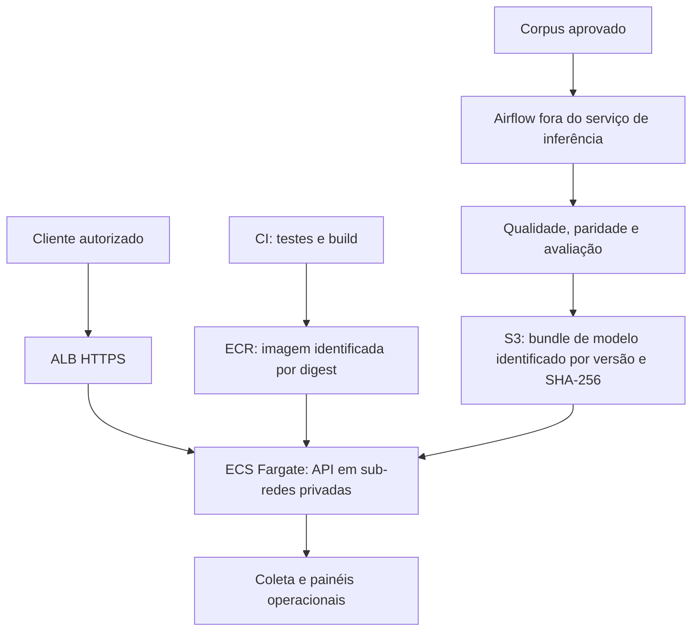

# Arquitetura e decisões operacionais

## Escopo

O serviço classifica um resumo médico em inglês em uma das cinco categorias do Medical Abstracts TC Corpus. A alteração do objetivo de urgência para condições médicas foi autorizada pelo usuário. A decisão arquitetural responde ao exercício de disponibilizar inferência textual com baixa latência, retreino controlado e observabilidade.

A implementação executável deste repositório é local, em Docker Compose. A implantação AWS descrita a seguir é uma proposta de produção; não há provisionamento, endereço público ou recursos AWS criados por estes arquivos.

## Decisão: inferência em tempo real, treino em batch

| Aspecto | Inferência síncrona pela API | Processamento batch |
|---|---|---|
| Uso neste projeto | Classificar um resumo enviado individualmente | Ingerir corpus, ajustar modelo, avaliar e publicar uma versão |
| Tempo de resposta | A resposta pertence à mesma requisição HTTP | A conclusão depende da execução de todas as tarefas |
| Recursos | Modelo carregado uma vez; CPU para vetorização e classificação | CPU e memória para ajuste e comparação dos artefatos |
| Falha | HTTP 422, 503 ou 500 conforme o contrato | Tarefa com erro, logs, nova tentativa e publicação bloqueada |
| Atualização | Nova versão carregada em reinício controlado | Produção de artefatos independentes da API em execução |

Uma aplicação que pede a classificação de um resumo por vez se beneficia da resposta síncrona. Executar treino dentro da requisição aumentaria a latência e tornaria o serviço dependente da duração e das falhas do pipeline. O retreino em Airflow utiliza recursos separados e só altera a versão publicada depois das verificações.

## Proposta AWS

**ECS Fargate + ALB** foi escolhido como desenho de implantação. Fargate executa os containers sem administração direta de instâncias EC2, e o ALB oferece encaminhamento HTTP/HTTPS para o serviço. A proposta mantém a imagem Docker que já é usada na demonstração. [Fargate para Amazon ECS](https://docs.aws.amazon.com/AmazonECS/latest/developerguide/AWS_Fargate.html), [ALB para serviços ECS](https://docs.aws.amazon.com/AmazonECS/latest/developerguide/alb.html).

O serviço teria tarefas em zonas de disponibilidade distintas, com grupo de destino do ALB do tipo `ip`, adequado à rede `awsvpc` do Fargate. A checagem de prontidão usaria `/ready`; `/health` apenas demonstra que o processo HTTP está vivo. O dimensionamento partiria de medições de CPU, memória, taxa de chamadas e p95 sob concorrência; o benchmark de concorrência um deste projeto não estabelece a capacidade máxima do serviço. O uso de alvos `ip` e as verificações de saúde fazem parte da [integração documentada ECS/ALB](https://docs.aws.amazon.com/AmazonECS/latest/developerguide/alb.html).

Os modelos seriam publicados em chaves versionadas de S3, com manifesto e hashes; as imagens usariam digest no ECR. A revisão da definição de tarefa fixaria a combinação de código e modelo. Um processo de inicialização precisaria baixar e verificar o bundle antes de responder como pronto. Esse mecanismo de download S3 e a infraestrutura de rede não foram implementados nesta demonstração.

O armazenamento imutável por versão permite investigar qual modelo respondeu a uma chamada e voltar à combinação anterior. A política proposta dá à API somente acesso de leitura ao prefixo dos modelos e separa a permissão de publicação do pipeline. Credenciais temporárias e configuração externa ao código fariam parte da implantação, com autenticação e TLS na entrada.

O custo da proposta inclui tarefas Fargate em execução, ALB, armazenamento, coleta de métricas e transferência de dados. Não foi feita cotação ou projeção financeira. Uma instância EC2 única reduziria a quantidade de componentes da demonstração, mas exigiria operação do host; Kubernetes acrescentaria uma camada de administração desnecessária ao tamanho atual do projeto. A escolha de Fargate é uma decisão de simplicidade operacional para containers, condicionada à medição de carga e orçamento reais.

## Implementação local

O Compose principal tem os serviços `pipeline`, `api`, `prometheus` e `grafana`. O pipeline termina antes de a API iniciar; os dados e os modelos ficam em volumes nomeados. O container da API usa UID/GID `10001:10001`, sistema de arquivos de leitura e volume de modelos somente para leitura. As portas publicadas ficam em `127.0.0.1`.

O comando do Compose usa `--reutilizar`: se já existe uma versão íntegra com relatórios aprovados e vinculados a seus hashes/identificador, o início não treina novamente. A primeira execução ainda precisa produzir o modelo. O [registro Docker](../reports/docker/execucao_stack.json) comprovou treino sem rede após disponibilizar o corpus, permissões restritas e reinício mantendo a versão.

Prometheus consulta `/metrics` pelo DNS da API dentro da rede Compose, e Grafana usa o DNS do Prometheus. O provisionamento inclui a fonte `prometheus-medical` e o dashboard `medical-classifier`. O JSON versionado é a fonte do dashboard; chamadas reais geram as séries consultadas pelo script `scripts/smoke_stack.py`.

O complemento `docker-compose.benchmark.yml` acrescenta `api-original`, com scikit-learn e porta local 8001. As duas APIs compartilham o volume de modelos, permitindo comparar o mesmo bundle com motores distintos. O verificador HTTP exige a mesma versão antes de medir.

## Ciclo de vida dos artefatos

1. O downloader verifica o corpus contra uma revisão fixa e hashes esperados.
2. A ingestão elimina sobreposição com o teste, remove conflitos no treino e produz ajuste/validação estratificados.
3. O treino ajusta o pipeline scikit-learn e exporta a mesma transformação textual para ONNX.
4. A validação verifica F1 macro e paridade, mede latência e avalia o teste oficial sem ajustar hiperparâmetros.
5. Cada execução grava um diretório em `models/releases/`, com os dois motores, metadados e relatórios.
6. A publicação verifica os hashes e substitui `models/current.json` atomicamente.
7. A API resolve o ponteiro e carrega uma única versão na inicialização.

A troca do ponteiro não modifica o modelo já carregado em memória. O operador reinicia a API depois da publicação para ativar a nova versão. A aplicação não oferece atualização automática de modelo, seleção por requisição ou fallback silencioso de ONNX para scikit-learn.

Quando a versão candidata e a ativa usam o mesmo hash de validação, a publicação também bloqueia regressão de F1 macro, com tolerância numérica de `1e-6`. O ponteiro conserva a versão anterior. Esse critério só compara populações idênticas; uma partição diferente não habilita automaticamente uma comparação de qualidade equivalente.

O piso de aceleração p50 igual a 1 é conservador e sujeito a ruído do host. A medição tem aquecimento, textos pareados, ordem alternada e 400 amostras por motor. A tentativa adicional do Airflow permite nova execução em falhas transitórias, mas não converte o critério em um SLO nem prova estabilidade sob carga. O benchmark compara ONNX e scikit-learn da mesma versão, sem medir regressão histórica entre versões.

Na demonstração Airflow, um identificador de execução delimita `/app/data/runs/<execucao>/`. O arquivo de validação precisa apontar para a mesma versão que será publicada. A DAG limita execuções e tarefas ativas a uma e desabilita recuperação automática de execuções antigas. `retries=1` define uma tentativa adicional; no Airflow 2.11, `airflow dags test` também a aplica, como registrado por `up_for_retry` e nova tentativa no CI remoto inicial. O standalone usa SQLite e executor sequencial; múltiplos trabalhadores exigiriam banco, executor, armazenamento compartilhado e política de concorrência adequados.

O treino acionado manualmente pelo Compose e o treino da DAG compartilham o destino de modelos. Execute um produtor por vez. A troca atômica evita um JSON parcial, mas não define uma política de prioridade entre duas publicações independentes.

A retenção é manual: mantenha a versão atual, a anterior e seus relatórios. Outras execuções só devem ser retiradas depois de arquivadas suas evidências e conferida a ausência de consumidores. Os volumes compartilhados são declarados externos na composição do Airflow; não os apague para limpar o estado do orquestrador. A imagem Airflow deriva da imagem da aplicação e instala o orquestrador em ambiente separado. `/opt/model-venv` aponta para `/opt/venv`, preservando os caminhos originais; a DAG usa o interpretador com `python -m`.

As constraints do Airflow 2.11 para Python 3.11 usam a revisão `338bcef28071e8b833876554c502079adb3739d0`, com SHA-256 `b32ab3fa687c0e04b2260526fee79813bfb7944da5b6805e429c9f71b07c53f3`. A verificação desse arquivo limita mudanças acidentais de dependências; a construção e o teste real da imagem continuam necessários.

A [execução registrada](../reports/airflow_execucao.json) concluiu ingestão, treinamento, validação e publicação, gerando `20260914T221243-003d412d`. O [comando de teste da DAG](../reports/docker/airflow_execution_steps.json) levou 66,6 segundos. A data lógica `2026-09-14T00:00:00+00:00` identifica a execução, sem medir seu tempo de parede. O standalone foi iniciado e teve metadatabase, scheduler e triggerer saudáveis; isso demonstra o ambiente local e não uma implantação de produção.

O diretório de modelos é uma fonte confiável da implantação. Hashes detectam corrupção ou troca acidental de arquivos, mas não impedem um atacante que possa editar simultaneamente modelo, metadados e ponteiro. O download também falha de forma explícita diante de um arquivo local divergente, sem apagá-lo ou refazê-lo automaticamente. A API mantém liveness em `/health` e sinaliza a falta do modelo em `/ready` com 503; encerrar o processo imediatamente na falha de carregamento não foi a política escolhida.

## CI/CD implementado

`ci.yml` configura validação de código, testes, Compose, imagens, importação/execução da DAG e funcionamento da stack. `entrega.yml` oferece publicação manual no GHCR a partir de `main`, usando o arquivo de imagem já validado pelo CI. A entrega confere SHA-256 e ID e não reconstrói a imagem antes do push. O token temporário do GitHub autentica a publicação. A execução remota inicial falhou no gate de paridade ONNX durante o treino da DAG, conforme o link no README. A ocorrência não se repetiu no treino diagnóstico posterior, com os mesmos critérios preservados. O push GHCR não foi comprovado, e esses arquivos não instalam infraestrutura AWS.

O artefato de imagem do CI é retido por sete dias. Depois da expiração, um novo CI completo deve gerar e validar outra imagem antes da publicação. Os disparos manuais de entrega não possuem controle de concorrência, por isso `latest` acompanha o envio que terminou por último. Para identificar uma versão, use a tag do commit e o digest da imagem.

O [CI remoto 34905435615](../reports/ci/34905435615/execucao.json) concluiu com sucesso no commit `9bee7b6`, incluindo testes, builds, DAG, stack e armazenamento da imagem validada. A ocorrência inicial de paridade permanece registrada separadamente, sem causa presumida. Os relatórios do retreino local estão em `reports/airflow/` e identificam `20260914T221243-003d412d`; os relatórios de cada CI ficam em `reports/ci/<execucao>/`.

A tag com SHA identifica a revisão do código; `latest` é uma referência conveniente e mutável. Para o desenho de produção, a revisão da tarefa ECS deveria usar digest de imagem e versão explícita do modelo. Os relatórios no repositório e os artefatos do workflow cumprem papéis distintos: um resultado local não comprova que o workflow já foi executado pelo GitHub.

## Observabilidade e limites

As métricas medem disponibilidade de coleta, prontidão do modelo, quantidade de requisições, duração e erros HTTP. Método, rota normalizada e status mantêm a quantidade de séries controlada. Textos recebidos não são rótulos nem conteúdo de logs da aplicação.

O dashboard não mede automaticamente acurácia em produção, deriva ou qualidade clínica. Essas avaliações exigiriam rótulos confiáveis e um processo de acompanhamento que não faz parte do serviço atual. As métricas de qualidade do projeto vêm das partições avaliadas durante o pipeline.

## Continuidade com a fase 2

Foram reaproveitados princípios de configuração explícita, pacote Python, API FastAPI, testes, lint, containers sem root, prontidão, versões identificáveis e documentação de evidências. A fase 3 concentra-se em inferência e operação de um modelo textual leve. DVC, MLflow e PyTorch não são dependências necessárias para esse escopo; os arquivos do modelo e o ponteiro de publicação formam um contrato menor que pode ser inspecionado diretamente.
